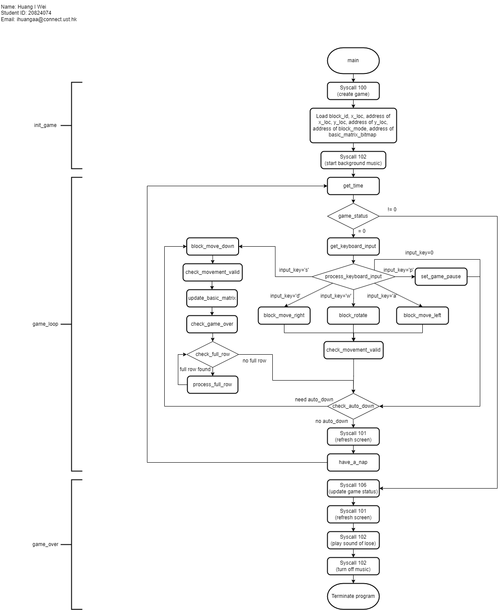

# MIPS_Tetris
Using MIPS assembly language to implement a Tetris Game. 

This is the flow chart of the program: \
 

This is the demo for the game: 

https://user-images.githubusercontent.com/91371465/231348114-1e219a46-c6ca-4557-a9e2-faa541e1898c.mov
